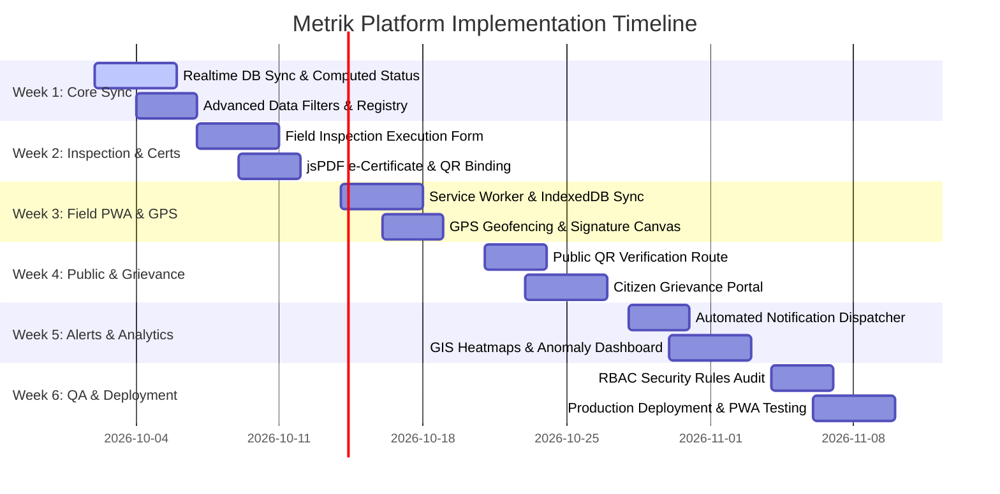

# 📋 Full End-to-End Implementation Plan: Metrik - Legal Metrology Platform (SIH Project)

## 📌 Executive Summary
**Metrik** is an enterprise-grade digital metrology management and compliance platform designed for the **Legal Metrology Department (Ministry of Consumer Affairs)**. It digitizes the end-to-end lifecycle of legal measuring instruments—from initial manufacturer registration, periodic inspector verifications, and tamper-proof e-sealing to public QR code authentication and automated compliance enforcement.

---

## 🏗️ System Architecture & Stack Overview

### 💡 Technology Stack
- **Frontend Core:** React 19, Vite, React Router v7
- **Styling System:** Custom CSS Glassmorphism Design Token System (`index.css` & `App.css`)
- **State Management & Auth:** React Context API (`AuthContext.jsx`) + Firebase Auth
- **Database & Storage:** Firebase Realtime Database (RTDB) / Firestore + Firebase Storage
- **Mobile & Offline PWA:** `vite-plugin-pwa` + Service Worker Cache + `IndexedDB` sync
- **Utility & UI Libraries:** `lucide-react` (Iconography), `jspdf` & `html2canvas` (e-Certificate generation), `qrcode.react` (QR seal binding)

---

## 🗄️ Database Schemas (Firebase RTDB / Firestore Structure)

```json
{
  "users": {
    "USER_UID_001": {
      "uid": "USER_UID_001",
      "name": "Rajesh Kumar",
      "email": "inspector.rajesh@metrology.gov.in",
      "role": "INSPECTOR", // "ADMIN" | "INSPECTOR" | "TRADER"
      "district": "Mysuru",
      "state": "Karnataka",
      "badgeId": "LM-INS-8842",
      "createdAt": "2026-01-15T09:00:00Z"
    }
  },
  "instruments": {
    "LM-2026-894123": {
      "id": "LM-2026-894123",
      "serialNumber": "SN-AX99231",
      "type": "Platform Scale", // "Platform Scale" | "Analytical Balance" | "Weighbridge" | "Fuel Dispenser"
      "capacity": "500kg",
      "accuracyClass": "Class III",
      "owner": "Acme Traders Pvt Ltd",
      "ownerContact": "+919876543210",
      "premises": "Main Market Premises, Mysuru",
      "district": "Mysuru",
      "status": "VALID", // "VALID" | "DUE_SOON" | "EXPIRED" | "PENDING_VERIFICATION"
      "lastVerified": "2025-11-19",
      "validUntil": "2026-11-18",
      "certificateNumber": "VM-2025-00451",
      "securitySealNumber": "SEAL-998811",
      "gpsLocation": { "lat": 12.2958, "lng": 76.6394 },
      "createdAt": "2025-11-19T10:00:00Z"
    }
  },
  "verifications": {
    "VERIF-2026-0091": {
      "verificationId": "VERIF-2026-0091",
      "instrumentId": "LM-2026-894123",
      "inspectorUid": "USER_UID_001",
      "inspectorName": "Rajesh Kumar",
      "verificationDate": "2026-10-01",
      "expiryDate": "2027-09-30",
      "testResults": [
        { "standardWeight": "100kg", "measuredWeight": "100.02kg", "errorMargin": "+0.02%", "passed": true }
      ],
      "mpeStatus": "PASSED",
      "physicalSealCondition": "INTACT",
      "newSealNumber": "SEAL-2026-7788",
      "inspectorSignature": "data:image/png;base64,...",
      "gpsStamp": { "lat": 12.2958, "lng": 76.6394 },
      "status": "APPROVED" // "APPROVED" | "REJECTED"
    }
  },
  "grievances": {
    "GRV-2026-104": {
      "grievanceId": "GRV-2026-104",
      "instrumentId": "LM-2026-894123",
      "citizenName": "Ananya Sharma",
      "citizenPhone": "+919123456789",
      "complaintType": "WEIGHT_INACCURACY", // "WEIGHT_INACCURACY" | "EXPIRED_SEAL" | "NO_CERTIFICATE"
      "description": "Scale measured 1kg as 850g at grocery shop.",
      "photoUrl": "https://storage.firebase.com/...",
      "status": "PENDING_INSPECTION", // "PENDING_INSPECTION" | "INVESTIGATING" | "RESOLVED"
      "createdAt": "2026-09-28T14:20:00Z"
    }
  }
}
```

---

## 🛠️ Detailed Step-by-Step Implementation Modules

### Module 1: Live Database Synchronization & Dynamic Computed Logic
**Goal:** Transition completely from static mock fallbacks to production-grade Firebase RTDB/Firestore live sync with computed lifecycle statuses.

- **File Modifications:** [`src/lib/instruments/instrument.service.js`](file:///c:/Users/manas/OneDrive/Desktop/sih%20project/metrology-platform/src/lib/instruments/instrument.service.js)
- **Key Deliverables:**
  - Real-time listener hooks (`onValue`) for instant UI updates when verifications occur.
  - Automated dynamic status calculation engine:
    ```javascript
    export const computeStatus = (validUntil, isPending) => {
      if (isPending) return 'PENDING_VERIFICATION';
      if (!validUntil) return 'PENDING_VERIFICATION';
      const today = new Date();
      const expiry = new Date(validUntil);
      const diffDays = Math.ceil((expiry - today) / (1000 * 60 * 60 * 24));
      if (diffDays < 0) return 'EXPIRED';
      if (diffDays <= 30) return 'DUE_SOON';
      return 'VALID';
    };
    ```

---

### Module 2: Field Inspector Verification Suite & MPE Checklist
**Goal:** Build a complete digital verification execution interface for field inspectors during on-site inspections.

- **New Component:** [`src/pages/InspectionExecution.jsx`](file:///c:/Users/manas/OneDrive/Desktop/sih%20project/metrology-platform/src/pages/InspectionExecution.jsx)
- **Key Features:**
  - **Standard Mass Calibrator Form:** Multi-point standard weight test entry (e.g. 10%, 50%, 100% capacity test).
  - **Maximum Permissible Error (MPE) Auto-Checker:** Automated compliance evaluation according to Legal Metrology General Rules 2011.
  - **Security Seal Replacement Logging:** Old seal removal code entry & new tamper-evident hologram seal registration.
  - **Pass/Fail Decision Workflow:** One-click approval generating e-Certificate or rejection issuing an official Non-Compliance Notice.

---

### Module 3: Digital e-Certificate Generator & Cryptographic QR Seal Binding
**Goal:** Automate instant digital PDF certificate generation with embedded cryptographic verification QR codes.

- **New Utility:** [`src/lib/certificateGenerator.js`](file:///c:/Users/manas/OneDrive/Desktop/sih%20project/metrology-platform/src/lib/certificateGenerator.js)
- **Key Features:**
  - Standardized official Legal Metrology Verification Certificate layout (Form VIII equivalent).
  - High-resolution SVG / PDF canvas rendering using `jsPDF`.
  - Dynamic QR code generation containing signed payload URL (`https://metrik.gov.in/verify/LM-2026-894123`).
  - Printable security sticker label generator for physical application onto weighing scales.

---

### Module 4: Mobile Field PWA, Geofencing & Digital Signature Capture
**Goal:** Guarantee full inspection functionality in remote rural markets with zero internet connectivity.

- **New Utility & Component:** [`src/lib/pwaSync.js`](file:///c:/Users/manas/OneDrive/Desktop/sih%20project/metrology-platform/src/lib/pwaSync.js), [`src/components/SignatureCanvas.jsx`](file:///c:/Users/manas/OneDrive/Desktop/sih%20project/metrology-platform/src/components/SignatureCanvas.jsx)
- **Key Features:**
  - `vite-plugin-pwa` configuration with background sync strategy for offline inspection submissions.
  - HTML5 Canvas signature pad for merchant sign-off and inspector validation.
  - HTML5 Geolocation API integration: Enforces on-site verification by recording `latitude`, `longitude`, and GPS accuracy radius.

---

### Module 5: Public QR Verification Portal & Citizen Grievance Ticketing
**Goal:** Empower consumers to scan any physical scale QR seal in markets to verify authenticity and report frauds.

- **New Page Component:** [`src/pages/PublicVerify.jsx`](file:///c:/Users/manas/OneDrive/Desktop/sih%20project/metrology-platform/src/pages/PublicVerify.jsx), [`src/pages/GrievanceForm.jsx`](file:///c:/Users/manas/OneDrive/Desktop/sih%20project/metrology-platform/src/pages/GrievanceForm.jsx)
- **Key Features:**
  - Publicly accessible non-authenticated route (`/verify/:id`).
  - Camera QR scanner integration using WebRTC canvas stream.
  - Instant Visual Badge: Green **VERIFIED & CALIBRATED** or Red **EXPIRED / UNREGISTERED**.
  - One-click "Report False Weights / Tampered Seal" form with instant photo attachment and auto-location detection.

---

### Module 6: Automated Multi-Channel Expiry Alerts & Reminders
**Goal:** Proactively notify merchants 30 days prior to verification expiry to prevent penalization.

- **Service Module:** [`src/lib/notifications.service.js`](file:///c:/Users/manas/OneDrive/Desktop/sih%20project/metrology-platform/src/lib/notifications.service.js)
- **Key Features:**
  - Automated cron check engine for instruments reaching `DUE_SOON` state.
  - Email template dispatcher for renewal notices.
  - SMS / WhatsApp alert trigger integration for merchant mobile notifications.

---

### Module 7: GIS Heatmaps, Analytics & Role-Based Access Control (RBAC)
**Goal:** Provide regional controllers with high-level intelligence and secure data access.

- **New Page Component:** [`src/pages/AnalyticsMap.jsx`](file:///c:/Users/manas/OneDrive/Desktop/sih%20project/metrology-platform/src/pages/AnalyticsMap.jsx)
- **Key Features:**
  - Interactive Leaflet / Mapbox GIS map displaying compliance heatmaps by district.
  - Anomaly detection dashboard: Identifies high non-compliance clusters and merchant recurring failure rates.
  - Strict Role-Based View Access:
    - `ADMIN`: Full system permissions & user management.
    - `INSPECTOR`: District-bounded inspection tasks & form submissions.
    - `TRADER`: Owned instrument dashboard & certificate downloads.

---

## 🗓️ 6-Week Execution Timeline Roadmap



---

## 🎯 Verification & Testing Protocol
1. **Automated Code Linting:** Run `npm run lint` (`oxlint`) to ensure zero syntax or formatting defects.
2. **Build Validation:** Run `npm run build` to verify clean Vite production bundle generation.
3. **PWA Lighthouse Audit:** Achieve > 90 score on PWA, Performance, Accessibility, and Best Practices.
4. **Security Audit:** Verify Firebase Realtime Database Security Rules prevent non-authenticated data mutations.
